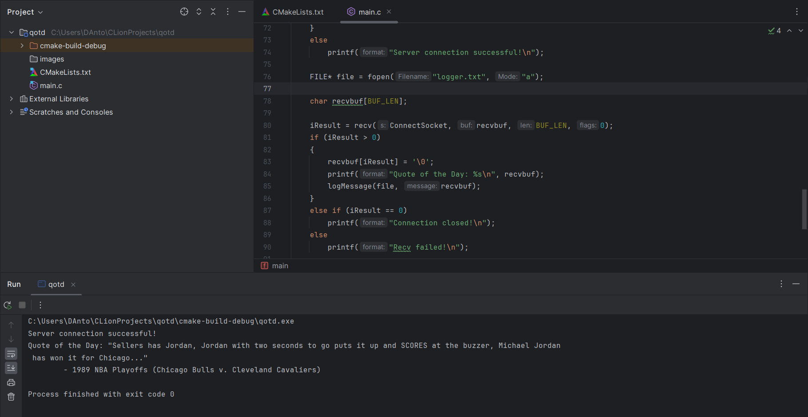

# Quote of the Day Client

## Discription
This C program is a little experiment, that creates a TCP connection to the Quote of the Day (QOTD) server and receives a message from it. The received information is written to a local `logger.txt` file with the date of receipt.

## How it Works
The program uses the Winsock API to create network requests. It starts by initializing Winsock, then obtains the server address, creates a socket, connects to the server and receives data from it. After receiving the data, the program logs the message and correctly ends the session by closing all network connections.

## Requirements
The following environment is required to compile and run the program:
- Windows operating system
- A compiler with C support (for example, I use MinGW)
- Installed Winsock library
